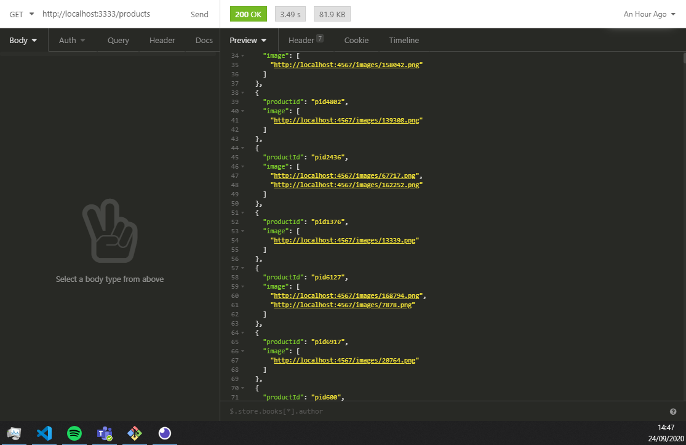

# 02-linx-challenge-url-aggregator

> ### Parte 2 - Agregador de URLs
>
> Recebemos um dump com lista de URLs de imagens de produtos que vamos utilizar para manter nossa base de dados atualizada. Este dump contém imagens de milhões de produtos e URLs, e é atualizado a cada 10 minutos:

```text
{"productId": "pid2", "image": "http://www.linx.com.br/platform-test/6.png"}
{"productId": "pid1", "image": "http://www.linx.com.br/platform-test/1.png"}
{"productId": "pid1", "image": "http://www.linx.com.br/platform-test/2.png"}
{"productId": "pid1", "image": "http://www.linx.com.br/platform-test/7.png"}
{"productId": "pid1", "image": "http://www.linx.com.br/platform-test/3.png"}
{"productId": "pid1", "image": "http://www.linx.com.br/platform-test/1.png"}
{"productId": "pid2", "image": "http://www.linx.com.br/platform-test/5.png"}
{"productId": "pid2", "image": "http://www.linx.com.br/platform-test/4.png"}
```

> As URLs pertencem a uma empresa terceirizada que hospeda a maioria destas imagens, e ela nos cobra um valor fixo por cada request. Já sabemos que o dump de origem não tem uma boa confiabilidade, pois encontramos várias imagens repetidas e boa parte delas também retornam status 404. Como não é interessante atualizar nossa base com dados ruins, filtramos apenas as URLs que retornam status 200.
>
> O processo de atualização deve receber como input um dump sanitizado, onde o formato é ligeiramente diferente da entrada:

```text
{"productId": "pid1", "images": ["http://www.linx.com.br/platform-test/1.png", "http://www.linx.com.br/platform-test/2.png", "http://www.linx.com.br/platform-test/7.png"]}
{"productId": "pid2", "images": ["http://www.linx.com.br/platform-test/3.png", "http://www.linx.com.br/platform-test/5.png", "http://www.linx.com.br/platform-test/6.png"]}
```

> Para diminuir a quantidade de requests necessárias para validar as URLs, decidimos limitar a quantidade de imagens por produto em até 3. O seu objetivo é criar um programa que gera o dump final no menor tempo possível e com o mínimo de requests desnecessárias \(já que existe um custo fixo por requisição\).
>
> O arquivo [input-dump.gz](/challenges_faml/02-linx-challenge-url-aggregator/-/blob/develop/./input-dump.gz) é um exemplo do dump de entrada. E você pode usá-lo para testar sua implementação. Também criamos uma api que responde as URLs do `input-dump.gz`. Ela é apenas um mock, mas vai te ajudar a implementar a solução do desafio. Para executá-la, basta:

> ```text
> gem install sinatra
> ruby url-aggregator-api.rb
> ```

## Solution:

* ReadDumpFileService:
  * The first step: the script require the input-dump.tar.gz in tmp/newFile folder. Where they are unzipped and the extracted file will be movendo to tmp/extracted folder. The script will be read the file convert data to string and remove leading and trailing white spaces, and delete the file. After this the collected data will be chunked in parts of 1000, and return this data.
* ProductsStandardizationService:
  * This step will be chunk the 1000 data size, in block data with 4 blocks of 250 each, to run in parallel and reduce the processing time of **71000 lines in 24.3s to 3.43s**. As shown in the following images.


* Continuing:
  * The next step is verify what product id as in product list. If this product does not exist on list the script will be call the api to validate the image response, where if the return is false they will go to next interation. And if they recive a true response the data will be pushed to productsList.
  * When the data has in productsList the script will be verify if the image length is les than 3. If yes it will verify if the image link has existing on productList. If Not exist it will verify the response of api to especified image, using the same strategy to save image. Return a list of JSON data with good images, with max 3 images, with less consult to API.

```text
[
  {
    "productId": "pid2436",
    "image": [
      "http://localhost:4567/images/67717.png",
      "http://localhost:4567/images/162252.png"
    ]
  },
  {
    "productId": "pid1376",
    "image": [
      "http://localhost:4567/images/13339.png"
    ]
  },
  {
    "productId": "pid6127",
    "image": [
      "http://localhost:4567/images/168794.png",
      "http://localhost:4567/images/7878.png"
    ]
  }
]
```

#### \*\*Obs: 

* _**I used Array.Map and Array.for to make the process more fast. exist others but ex: \(for...in\) lost performance, his is good to ordered list of data. And Array.ForEach is not good to asynchronous job.**_
* _**To be improve more performance, we can change the solution of read the file to use STREAM: A stream is an abstract interface for working with streaming data in Node.js. But i need improve more my knowlegd to make a good solution with STREAM.**_

## The architecture:

* The back-end is ready to be exported to a any version of JavaScript. Was used TypeScript and React to resolve the scarcity of developers with knowledge of leged versions.
* The persistence of data are ready to grow up or be change. Today we use Redis to Cache data, but it's ready to accept any other.
* The project is ready to be scaled. applying many type of solutions to that. At choice of project.

#### S.O.L.I.D principles / DDD and TDD.

I applied the DDD \(Domain-Driven Design\), segmented through knowledge area \(module/archive\). Applied to a few concepts of S.O.L.I.D, and developed with TDD applying unity tests.

#### Libraries:

* Dotenv: Loads environment variables from .env file.
* Express: Fast, unopinionated, minimalist web framework. REST.
* Reflect-metadata: Polyfill for Metadata Reflection API.
* Tsyringe: Lightweight dependency injection container for JavaScript/TypeScript.
* class-transformer: Proper decorator-based transformation / serialization / deserialization of plain javascript objects to class constructors.
* multer: Middleware for handling `multipart/form-data`.
* request-ip: A small node.js module to retrieve the request's IP address
* Redis: A robust, performance-focused and full-featured Redis client for Node.js.
* rate-limiter-flexible: library to prevent ddos.
* swagger-ui-express: Swagger UI Express.
* axios: Promise based HTTP client for the browser and node.js.
* chunk: Chunk converts arrays.
* decompress: Extracting archives made easy.
* move-file: Move a file - Even works across devices.
* remove-blank-lines: Remove blank lines from a string.

## Getting Start

1. You should be have the LTS version of the node.
   1. [https://nodejs.org/en/](https://nodejs.org/en/)
      1. Ex: 12.18.3 LTS
2. After the node js install, you should be install the yarn Package Manager
   1. **npm install -g yarn**
3. **You need clone the back end project:**
   1. [https://github.com/Fernandoaml/02-linx-challenge-url-aggregator.git](https://github.com/Fernandoaml/02-linx-challenge-url-aggregator.git)
   2. Go to the folder and on command line interface you must be run this command: **yarn**
   3. Verify if the **input-dump.tar.gz**  _**\(is in tmp/newFile folder\).**_
4. **After run: yarn dev:server**
5. Now you can call the api to process the data file:



## **Tests:**

* **Back End:**
  * To Back end i used the JEST to make the TDD aplying unity tests
  * If you're with command line opened, you must open a new interface of command line in the same folder and run the next command.
    * **yarn test**


* **To see the coverage report \(Lcov-report\) you need to open the following file**:
  * \02-linx-challenge-url-aggregator\coverage\lcov-report\index.html

## API - Swagger UI

* after of initialization of back-end. You will can access the Swagger page, to see the description of the API REST of 02-linx-challenge-url-aggregator. The page as exemplification, as shown in the image below.
  * [http://localhost:3333/swagger/](http://localhost:3333/swagger/)


